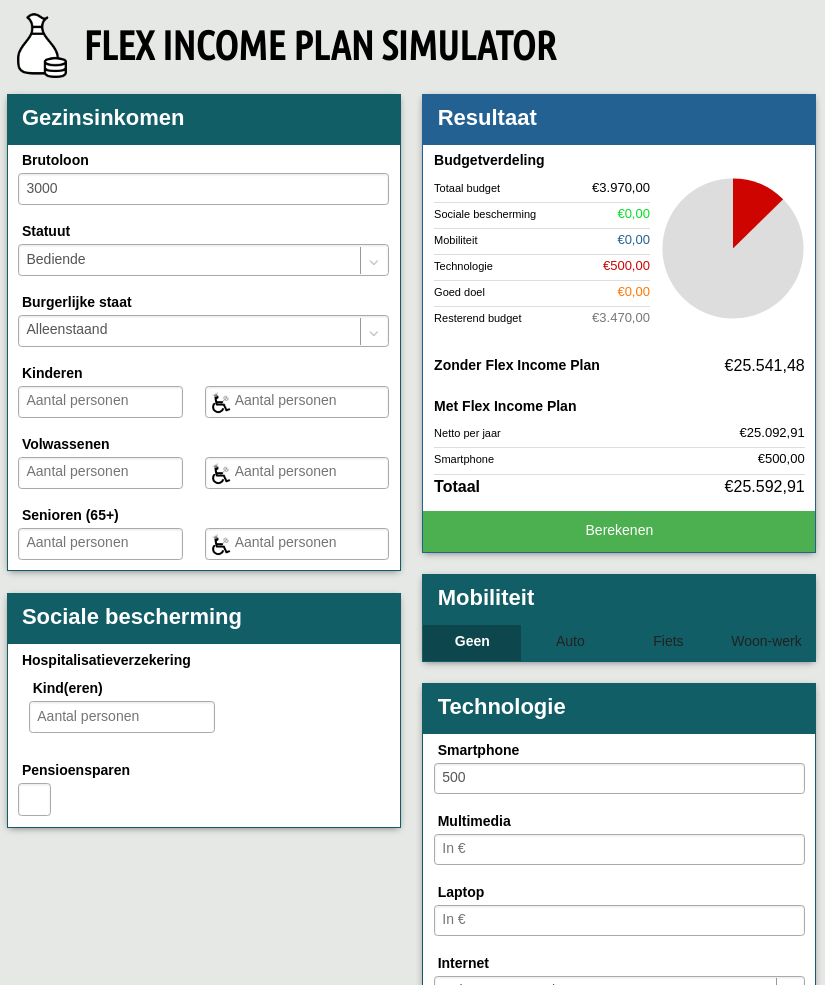

# Hoe te gebruiken:

Maak een lokale kopie:

    git clone https://github.com/SamyCoenen/FIP.git && cd FIP

Installeer [Docker Compose](https://docs.docker.com/compose/install/) en doe:

    docker-compose up

Daarna is de applicatie beschikbaar op localhost op poort 80.

# Licentie

Alle bestanden zijn in licentie gegeven krachtens de EUPL v.1.1.

Gelieve tevens rekening te houden met alle andere auteursrechtvermeldingen
in de gebruikte onderdelen.
